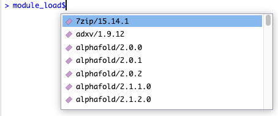
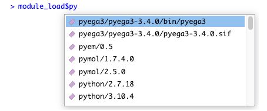

Environment Modules
================

The EnvironmentModules package is an R front-end for the [Environment
Modules](https://modules.readthedocs.io/en/latest/index.html) project,
which offers a way to load and unload packages, and is commonly used on
shared HPC (High Performance Computing) environments.

## Setup

Currently `EnvironmentModules` is not on CRAN, so you will have to
install it as follows:

``` r
remotes::install_github("WEHI-ResearchComputing/EnvironmentModules")
```

``` r
library(EnvironmentModules)
```

## Listing Modules

You can list the available modules:

``` r
module_avail()
#>   [1] "7zip/15.14.1"                            "adxv/1.9.12"                             "alphafold/2.0.0"                        
#>   [4] "alphafold/2.0.1"                         "alphafold/2.0.2"                         "alphafold/2.1.1.0"                      
#>   [7] "alphafold/2.1.2.0"                       "alphafold/2.2.0.0"                       "anaconda3/2019.03"                      
#>  [10] "anaconda3/2020.07"                       "anaconda3/4.0.0"                         "anaconda3/4.3.1"                        
#>  [13] "anaconda3/latest"                        "annovar/2015-12-14"                      "apache-ant/1.9.7"                       
#>  [16] "apptainer/1.0.0"                         "apptainer/1.1.0"                         "aspera/3.5.4"                           
#>  [19] "aspera/3.9.1"                            "aspera/3.9.6"                            "autoPROC/20211020"                      
#>  [22] "autoPROC/20220608"                       "autoPROC/20230222"                       "autoSHARP/2.8"                          
#>  [25] "awscli/1.16py2.7"                        "awscli/1.16py3.7"                        "awscli/1.22.89"                         
#>  [28] "awscli/2.1.25"                           "awscli/2.5.2"                            "axel/2.17.10"                           
#>  [31] "bamtools/2.4.1"                          "bamUtil/1.0.14"                          "bazel/0.26.1"                           
#>  [34] "bazel/1.2.1"                             "bcftools/1.12"                           "bcftools/1.13"                          
#>  [37] "bcftools/1.14"                           "bcftools/1.15"                           "bcftools/1.16"                          
#>  [40] "bcftools/1.17"                           "bcftools/1.3.1"                          "bcftools/1.6"                           
#>  [43] "bcftools/1.7"                            "bcftools/1.9"                            "bcl-convert/3.10.5"                     
#>  [46] "bcl-convert/3.9.3"                       "bcl2fastq/2.19.1"                        "bcl2fastq/2.20.0"                       
#>  [49] "beast/1.8.3"                             "beast2/2.4.0"                            "bedops/2.4.26"                          
#>  [52] "bedtools/2.25.0"                         "bedtools/2.26.0"                         "binutils/2.35.2-gcc-4.8.5"              
#>  [55] "binutils/2.35.2-gcc-9.1.0"               "biobambam2/2.0.182-gcc9.1.0"             "bismark/0.16.1"                         
#>  [58] "bismark/0.19.0"                          "bismark/0.19.1"                          "bismark/0.20.0"                         
....
```

You can also easily filter to only modules containing a substring:

``` r
module_avail("python")
#>  [1] "python/2.7.18"      "python/3.10.4"      "python/3.5.1"       "python/3.5.3"       "python/3.6.5-intel" "python/3.7.0"       "python/3.7.13"     
#>  [8] "python/3.8.3"       "python/3.8.8"       "python/3.9.5"
```

## Loading and Unloading Modules

Load modules using `module_load()`!

``` r
module_load("python/3")
#> ✔ Successfully loaded python/3
```

If you’ve already loaded a module, you will be notified:

``` r
module_load("python/3")
#> ℹ Nothing to do. This module was probably already loaded. Use module_list() to verify.
```

You can unload a module using the corresponding `module_unload()`:

``` r
module_unload("python/3")
#> ✔ Successfully unloaded python/3
```

## Listing Loaded Modules

You can list modules that have been already loaded with `module_list()`:

``` r
module_load("python/3")
#> ✔ Successfully loaded python/3
module_list()
#> [1] "python/3.8.8"
```

## Autocomplete

Both `module_load` and `module_unload` support a “magic” autocomplete
that activates if you put a dollar sign after the function name.

For example, you can type `module_load$` and the following will appear
in RStudio:

<!-- -->

This autocomplete will adjust as to type, to let you quickly filter down
all the available modules:

<!-- -->

To actually load the module, just press enter:

``` r
module_load$`python/3.7.13`
#> ✔ Successfully loaded python/3.7.13
#> [1] TRUE
```

## Linking Shared Libraries

Although `module_load()` will add a module’s libraries to your
`LD_LIBRARY_PATH`, which will allow you to compile packages against
them, R will not necessarily be able to actually run packages that use
these libraries.

For example, let’s say we want to use the `hdf5r` package, which depends
on the `hdf5` library package. We don’t have `hdf5` loaded, so it will
fail:

``` r
utils::install.packages("hdf5r", quiet=TRUE)
#> Warning in utils::install.packages("hdf5r", quiet = TRUE): installation of package 'hdf5r' had non-zero exit status
```

Let’s see what happens if we load the appropriate module. Firstly, we
need to find out what the module is called:

``` r
module_avail("hdf5")
#> [1] "hdf5-mpich/1.10.5_3.3" "hdf5/1.10.5"           "hdf5/1.12.1"           "hdf5/1.12.2"           "hdf5/1.8.16"           "hdf5/1.8.20"          
#> [7] "hdf5/1.8.21"
```

We can now load the module:

``` r
module_load("hdf5/1.12.2")
#> ✔ Successfully loaded hdf5/1.12.2
```

Now let’s try again:

``` r
utils::install.packages("hdf5r", quiet=TRUE)
```

Finally, we can load the package itself… or can we?

``` r
library(hdf5r)
#> Error: package or namespace load failed for 'hdf5r' in dyn.load(file, DLLpath = DLLpath, ...):
#>  unable to load shared object '/stornext/Home/data/allstaff/m/milton.m/R/x86_64-pc-linux-gnu-library/4.2/hdf5r/libs/hdf5r.so':
#>   libhdf5_hl.so.200: cannot open shared object file: No such file or directory
```

As alluded to above, R doesn’t actually load every new library that
becomes available in the environment. Rather it uses “load-time
linking”, which is where the libraries it links to are fixed at the time
you start R. Now, you can resolve the above error by closing R, loading
the module, and then restarting R, but this can be quite annoying.

Fortunately this package supports installing packages in a special way
that hints to the package where to find the modules it needs. This means
that you won’t have to restart R, or even load the modules the next time
you want to use the package:

``` r
utils::install.packages("hdf5r", quiet=TRUE) |> with_module_install()
```

``` r
library(hdf5r)
```

It worked!

If you are interested in the theory underlying what is happening here,
you might find Linux’s `ld.so` manual page interesting. Either run
`man ld.so` on Linux, or visit this page:
<https://man7.org/linux/man-pages/man8/ld.so.8.html>.

Specifically, this package uses the `DT_RPATH` approach to dependency
resolution.

## Other Commands

This package also supports the following.

`module_swap()` unloads the first module and loads the second:

``` r
module_swap("hdf5/1.12.2", "hdf5/1.10.5")
```

`module_purge()` unloads all modules:

``` r
module_purge()
```

## Advanced Commands

If you want to use a feature of Environment Modules that does not (yet)
have a dedicated function, you can use the advanced functions
`get_module_code` or `get_module_output`.

If you want to run a command that doesn’t edit the modules, but only
shows output, run `get_module_output`

``` r
get_module_output(c("show", "hdf5"))
```

<head>
</head>
<pre>-------------------------------------------------------------------
<span class="ansi ansi-bold">/stornext/System/data/modulefiles/bioinf/its/hdf5/1.12.1</span>:

<span class="ansi ansi-color-2">module-whatis</span>    {HDF5 is a unique technology suite that makes possible the management of extremely large and complex data collections. (v1.12.1)}
<span class="ansi ansi-color-2">conflict</span> hdf5
<span class="ansi ansi-color-2">prepend-path</span> PATH /stornext/System/data/apps/hdf5/hdf5-1.12.1/bin
<span class="ansi ansi-color-2">prepend-path</span> CPATH /stornext/System/data/apps/hdf5/hdf5-1.12.1/include
<span class="ansi ansi-color-2">prepend-path</span> LD_LIBRARY_PATH /stornext/System/data/apps/hdf5/hdf5-1.12.1/lib
<span class="ansi ansi-color-2">prepend-path</span> LIBRARY_PATH /stornext/System/data/apps/hdf5/hdf5-1.12.1/lib
<span class="ansi ansi-color-2">prepend-path</span> MANPATH :/stornext/System/data/apps/hdf5/hdf5-1.12.1/share/man
-------------------------------------------------------------------</pre>

If the module does edit the modules, use `get_module_code()`, and
evaluate the result:

``` r
get_module_code("reload") |> eval()
#> NULL
```

## FAQ

> Environment Modules [supports loading modules in R since version
> 4.0.0!](https://modules.readthedocs.io/en/latest/index.html) What is
> the point of this package?

This is true, and actually this package is just a wrapper around that
core functionality. You *need* Modules version 4.0.0 or above to run
this package. The main advantages of using this wrapper are the nicer
function interfaces, nice documentation, and the ability to
automatically “bake in” the modules to packages you install.

> I’m getting the error “Could not detect an Environment Modules
> installation”, but I know that Environment Modules is installed on my
> system. What do I do?

First, in a bash terminal where the `module` command works correctly,
run `which modulecmd`. Then in R, run
`Sys.setenv(MODULES_CMD="</path/to/modulecmd>")`, putting the output
from the previous step as the argument value. Then everything should
work!
